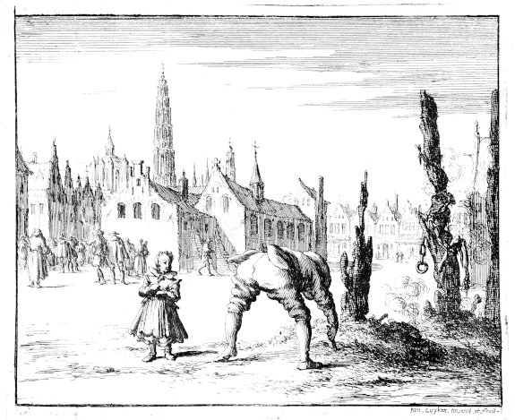

# Maeyken Wens

  
Maeyken Wens's son Adriaen Wens, picks through the ashes after his mother was burned to death to find the tongue screw used to keep her from speaking while taken to be executed.

The following is the account of Maeyken Wens from *The Bloody Theater or Martyrs Mirror of the Defenseless Christians*, compiled by Thieleman J. van Braght and published in 1660.

MAEYKEN WENS, AND SOME OF HER FELLOW-BELIEVERS,
BURNT FOR THE TESTIMONY OF
JESUS CHRIST, AT ANTWERP, A. D. 1573.

The north wind of persecution blew now the longer
the more through the garden of the Lord, so that
the herbs and trees of the same (that is the true believers)
were rooted out of the earth through the
violence that came against them. This appeared,
among other instances, in the case of a very godfearing
and pious woman, named Maeyken Wens,
who was the wife of a faithful minister of the church
of God in the city of Antwerp, by the name of
Mattheus Wens, by trade a mason. About the
month of April, A. D. 1573, she, together with
others of her fellow-believers, was apprehended at
Antwerp, bound, and confined in the severest
prison there. In the meantime she was subjected to
much conflict and temptation by so-called spirituals
(ecclesiastics), as well as by secular persons, to cause
her to apostatize from her faith. But when she
could by no manner of means, not even by severe
tortures, be turned from the steadfastness of her
faith, they, on the fifth day of October, 1573, passed
sentence upon her, and pronounced it publicly in
court at the aforementioned place, namely, that she
should, with her mouth screwed shut, or with her
tongue screwed up, be burnt to ashes as a heretic,
together with several others, who were also imprisoned
and stood in like faith with her.

Thereupon, the following day, the sixth of October,
this pious and godfearing heroine of Jesus
Christ, as also her fellow-believers that had been
condemned with a like sentence, were brought forth,
with their tongues screwed fast, as innocent sheep
for the slaughter, and each having been fastened to
a stake in the market place, deprived, by fierce and
terrible flames, of their lives and bodies, so that in
a short time they were consumed to ashes; which
severe punishment of death they steadfastly endured;
hence the Lord shall hereafter change their
vile bodies, and fashion them like unto his glorious
body. Philip. 3:21.

*Further observation.*

The oldest son of the aforementioned martyress,
named Adriaen Wens, aged about fifteen years,
could not stay away from the place of execution on
the day on which his dear mother was offered up;
hence he took his youngest little brother, named
Hans (or Jan) Mattheus Wens, who was about
three years old, upon his arm and went and stood
with him somewhere upon a bench, not far from the
stakes erected, to behold his mother's death.

But when she was brought forth and placed at
the stake, he lost consciousness, fell to the ground,
and remained in this condition until his mother and
the rest were burnt. Afterwards, when the people
had gone away, having regained consciousness, he
went to the place where his mother had been burnt,
and hunted in the ashes, in which he found the
screw with which her tongue had been screwed fast,
which he kept in remembrance of her.

There are at present, 1659, several grandchildren
(well known to us) still living of this pious martyress,
who are named after her.

Touching the others, her fellow-believers, who
were put to death with her, we are not able, because
it is so long ago, to give their names, but it
appears to us, that they are those who are mentioned
in the next following account (that is, the
women) since it is stated of them, that they were,
on the same day, namely the sixth of October,
1573, also put to death, at Antwerp, by fire. This
by way of notice.

THE LETTERS AND TESTAMENTS OF MAEYKEN
WENS, WIFE OF MATTHEUS WENS, MASON, IN
HIS LIFE-TIME A MINISTER OF THE CHURCH
OF GOD AT ANTWERP; OFFERED UP THE
6TH OF OCTOBER, 1573.

Grace and peace from God the Father, through
Jesus Christ his only begotten Son, who grant you
wisdom and understanding, that you may wisely
govern yourself and your children, and bring them
up in the fear of God, to which end may the good
Father strengthen you, and the Holy Ghost comfort
you in your tribulation. This is the greeting
and wish of my heart to you my dear and much beloved
husband in the Lord. After all salutation, I
inform you that I am still tolerably well according
to the flesh, and also according to the spirit I trust I
am doing the best; but my best is nothing special,
and I regret, that I am not more thankful for all
that comes upon me, for it is all the work of the
Lord. We ought to thank the Lord in adversity as
well as in that which is agreeable to the flesh; for if
the Lord takes all from us, he takes from us no
more than what he has lent us, for it belongs to us
no longer than it pleases the Lord. O that I could
always thank the Lord as well when the flesh suffers
adversity, as when it prospers--then we can
thank the Lord indeed.

O my dear friend, I should never have thought
that parting should come so hard to me as it does.
True the imprisonment seemed hard to me; but that
was because they were so tyrannical; but now the
parting is the hardest of all.

O my very dear and beloved husband, pray the
Lord heartily in my behalf, to remove the conflict
from me; for it is in his power, if it is his pleasure.
Truly the Lord has said: He that does not forsake
everything is not worthy of me; for the Lord well
knew that it would come hard to the flesh. But I
hope that the Lord will also help me through even
as he has helped many, and for which I can simply
trust him. O how easy it is to be a Christian,
so long as the flesh is not put to the trial, or nothing
has to be relinquished; then it is an easy thing to be
a Christian.

Herewith I will conclude my letter, and commend
you and your children to the Lord, that you may
walk in wisdom, to the edification of your neighbor,
and the salvation of your soul. I commend you to
the Lord, and to the rich word of his grace: this is
the good greeting and wish of my heart. As regards
further the visiting, you may do in the matter according
to your pleasure; for I should indeed often
desire your visit, were it not for the expense. But if
you want to make your heart glad, you may come;
I dare say nothing else, except that it costs so
much, else I should desire to have you come soon.
If you come, go to no expense in the way of
bringing anything with you, as it costs far too much.
No more for this time, except that you may prosper
in soul and body; this is my desire. Greet the acquaintances
in the Lord much in my name, and
also the friends according to the flesh. My companions
also greet you much. My children also
come in for a share.

Written in my bonds by me,

Maeyken Wens.

THE SECOND LETTER FROM MAEYKEN WENS,
WRITTEN TO HER HUSBAND.

The grace and peace of God the Father, and the
great mercy and love of the Son our Lord Jesus
Christ, who through grace was sent by the Father
to the salvation of all those that have died unto their
sins, and are thus risen with Christ unto newness
of life; and the eternal, unfathomable joy, comfort,
and fellowship of the Holy Ghost, strengthen and
keep your hearts and minds in Christ Jesus, to
whom be glory forever and ever. Amen.

After all cordial salutation to you my very dear
and beloved husband and brother in the Lord, I inform
you that my heart is still fixed to offer up a
sacrifice to the Lord, the Lord be praised for the
great grace which he shows to me poor, miserable
creature. And I am also tolerably well according
to the flesh, as I trust through the grace of the
Lord that it is also with you, my most beloved in
the Lord. Nothing more for this time, but I commend
you to the Lord and to the words of his grace;
this is the good wish and greeting of my heart.
Farewell. Pray for me.

By me, your dear wife and sister in the Lord.

Maeyken Wens.

THE THIRD LETTER FROM MAEYKEN WENS, WRITTEN
IN PRISON AT ANTWERP, THE 21ST OF
APRIL, A. D. 1573, TO HER SON.

*Always fear God and love him above all.*

My dear child Adriaen, my son, I leave you this
for a testament, because you are the oldest, to exhort
you that you should begin to fear our dear
Lord, for you are getting old enough to perceive
what is good or evil; think of Betteken, who is
about as old as you are. My son, from your youth
follow that which is good and depart from evil: do
good while you have time, and look at your father,
how lovingly he went before me with kindness and
courteousness, always instructing me with the word
of the Lord. O if I had so followed after him, how
light would be my bonds! Hence, my dear son,
beware of that which is evil, that you will not have
to lament afterwards: Had I done this or that; for
then, when it is as far as it now is with me, it will
be too late. Hear the instruction of your mother:
hate every thing that is loved by the world and
your sensuality, and love God's commandment,
and let the same instruct you, for it teaches: If any
man will come after me, let him deny himself, that
is, forsake his own wisdom, and pray: "Lord, thy
will be done." If you do this, the anointing of the
Holy Ghost will teach you all that you are to
believe. 1 John 2:27. Believe not what men say,
but obey that which the New Testament commands
you, and ask God to teach you his will.
Trust not in your understanding, but in the Lord,
and let your counsel abide in him, and ask him to
direct you into his ways. My child, learn how you
are to love God the Lord, how you are to honor
your father, and all other commandments which the
Lord requires of you. Whatsoever is not contained
therein, believe not, but whatever is contained
therein, obey. Join yourself to those that fear the
Lord, and depart from evil, and through love do
all that is good.

O regard not the great multitude, or the ancient
custom, but look at the little flock, which is persecuted
for the word of the Lord, for the good persecute
none, but are persecuted. When you have
joined them, beware of all false doctrine, for John
says: "Whosoever transgresseth, and abideth not in
the doctrine of Christ, hath not God. He that abideth
in the doctrine of Christ, he hath both the Father
and the Son." 2 John 9. The doctrine of Christ
is mercy, peace, purity, faith, meekness, humbleness,
and full obedience to God.

My dear son, yield yourself to that which is good:
the Lord will give you understanding. I give you
this as my last adieu to you. My dear child, heed
the Lord's chastening; for whenever you do evil,
he will chasten you in your mind; desist, then, and
call to the Lord for help, and hate that which is evil,
and the Lord will deliver you, and good will come
to you. God the Father, through his beloved Son
Jesus Christ, grant you his Holy Spirit, that he may
guide you into all truth. Amen.

This, I, Maeyken Wens, your mother, have written,
while I was in prison for the word of the Lord;
the good Father grant you his grace, my son Adriaen.
Write me a letter as to what your heart says,
whether you desire to fear the Lord; this I should
like to know. But you must write it better than
the last two letters were written; the one which
Maeyken Wils brought however, was good.

Wherefore, let them that suffer according to the
will of God commit the keeping of their souls to
him in well doing, as unto a faithful Creator. 1 Peter
4:19.

THE FOURTH LETTER FROM MAEYKEN WENS,
WRITTEN TO HER SON.

O my dear son, though I am taken from you
here, strive from your youth to fear God, and you
shall have your mother again up yonder in the New
Jerusalem, where parting will be no more. My dear
son, I hope now to go before you; follow me thus
as much as you value your soul, for besides this
there shall be found no other way to salvation.
Thus, I will now commend you to the Lord; may
he keep you. I trust the Lord that he will do it, if
you seek him. Love one another all the days of your
life; take Hansken on your arm now and then for
me. And if your father should be taken from you,
care for one another. The Lord keep you one and
all. My dear children, kiss one another once for
me, for remembrance. Adieu, my dear children,
all of you. My dear son, be not afraid of this suffering;
it is nothing compared to that which shall
endure forever. The Lord takes away all fear; I did
not know what to do for joy, when I was sentenced.
Hence cease not, to fear God, because of this temporal
death; I cannot fully thank my God for the
great grace which he has shown me. Adieu once
more, my dear son Adriaen; ever be kind, I pray
you, to your afflicted father all the days of your life,
and do not grieve him; this I pray all of you, for
what I write to the oldest, I also mean to say to
the youngest. Herewith I will commend you to the
Lord once more. I have written this, after I was
sentenced, to die for the testimony of Jesus Christ,
on the fifth day of October, in the year of our Lord
Jesus Christ 1573.

By me, your mother, who gave you birth in
much pain, as a memorial to you. Preserve well this
the adieu which your father wrote your mother when
she had been sentenced, and the adieu of your
mother.

Maeken Wens.

THE FIFTH LETTER FROM MAEYKEN WENS, WRITTEN
TO JAN DE METSER, MINISTER.

*Love God above all; he it is who is, and shall be.*

The rich grace and peace of God the Father, and
the love of Jesus Christ; may he be your comforter.
Though we must now die, we are better off than
you who remain in this vale of tears; however, one
must bide the time with patience till the Lord comes.
O my brother in the Lord, I would so gladly have
written you a short letter, but my time has slipped
away, although I have been confined long enough.
But I am such a poor writer; hence you must excuse
me, and think, if you were invited to a table
somewhere, would you not certainly be satisfied
with that which was prepared? So you must also
be satisfied with my writing, for I do not have much,
and hence I cannot give much. And now I can also
not write much, because I have been sentenced;
nevertheless I was so full of joy, that I should not
be able to express it with the mouth, the Lord be
forever praised for the great grace he has shown
me, who has feared so much. O what a strong
God we have, compared with what we see the
wicked have. O let us have good courage; we
shall devour our enemies like bread. I go before
you to-morrow; the Lord grant you strength, that
you may come to me, as I trust you will. But, my
dear brother in the Lord, always watch, for the
Lord will come as a thief in the night, when we
least expect it, for this was my experience; it is
good then, that a man be not sleeping. But, dear
Jan, I should have written you more, but my time
of delivery came on speedily, hence my flesh begins
to tremble somewhat; however this is the nature
of the flesh. I will herewith commend you to the
Lord, and to the word of his grace. Farewell, my
dear friend Jan. I have written you this the night
I was sentenced, that you might have something
from my hand, for old acquaintance' sake. Take
my simple letter in good part, for I would not
have thought that I could write you so much yet
after I was sentenced. I will now bid you adieu
here in this world; but I hope that we shall see
each other up yonder in the New Jerusalem, where
parting shall be no more. However, I hope that
before this letter shall have been read, I shall have
entered into rest by the help of the Lord; and I
also hope to be an epistle which shall be read
of all men. 2 Cor. 3:2. Adieu, adieu, dear friend.
Greet your dear wife much in my name, and tell
her that if she has seen aught in me which did
not edify her, not to follow me therein; but if she
has seen anything that was edifying, to follow that
which is best. This is the good wish of my heart,
written to you on the fifth day of October, 1573.
My fellow prisoners also greet you much.

Written in my bonds, by me your weak sister, as
much as I am able, which is but little.

Maeyken Wens.

